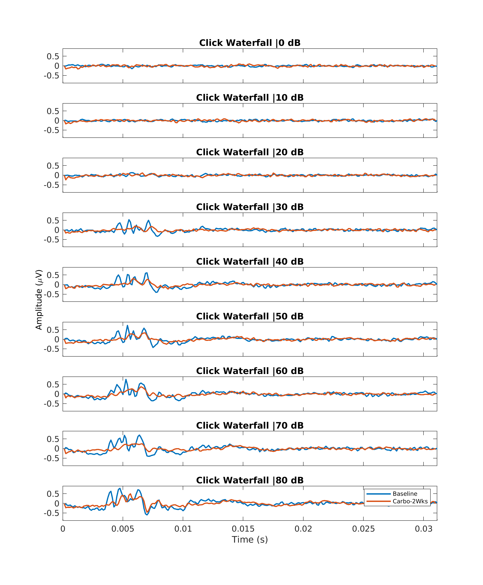

# ABR_Tools

This repository has been designed to quickly visualize ABR data, and will be edited to make meaningful computations (i.e. peak-peaking, threshold calculations, etc.). Our data is usually collected in a custom ```.mat``` structure with ABR waveforms and necessary metadata (i.e. Sampling Rate) stored in sub-structures.

To begin, be sure that you are aware how data is pulled into the code. 

I have structured my data directory within my **ABR_Tools** local folder. The data is organized in my ``Data`` directory as shown below:

```bash
├── ABR_Tools
│   ├── Data (Data should be stored locally, not uploaded to git)
│   │   ├── Chin
│   │   │	├── Pre
│   │   │	│	├── Baselines
│   │   │	│	│	├── [picnumber]*ABR_4000.mat
│   │   │	│	│	├── [picnumber]*ABR_click.mat
│   │   │	├── Post
│   │   │	│	├── 2weeksPostCA
│   │   │	│	│	├── ---.mat
│   ├── abr_compare.m
```

**Note: since these datasets can be quite large, any directory titled  ``Data`` will be ignored in commits. You should have your own data in a local directory. **This is specified in the ``.gitignore`` file.

**Currently, the pre/post directories do not require a specific directory structure and use user-specified directories. However, future versions of this code may require the above structure to work.** The directories are specified in ``pre_data_folder`` and ``post_data_folder`` within the code.

 

## Running the script ## 

There are parameters that must be modified at the beginning of the script. As this script has been designed to compare two ABR waterfalls (e.g. the "pre" or "post" exposure of a single chin), the data files need to be indicated. Specifically, the pic numbers for each ABR file need to be adjusted in ``pre_click`` ,``pre_4k``, ``post_click``, and ``post_4k`` variables. **If you don't want to compare anything, just set the pre/post lists and data directories equal to each other.**

Because ``SampleRate`` may not be consistent between these (though it should), I also resample the data at sampling frequency, ``fs``. Finally, ``cutoff`` specifies the high-pass and low-pass cutoff frequencies to use in the digital (Butterworth) filtering used. Additionally, there is a ``scaling`` vector that allows you to quickly invert responses in one trial (or both) in the case electrodes were reversed.

After a successful run, this is an example of what the first figure might look like: 

## Contributing ## 

This is the start of a work in progress, with contributions from lab members resulting in more features for visualization and analysis. 

Here is a suggested workflow if you have a feature/edit you wish to contribute:

1. **Fork** this repo to your personal GitHub
2. Create a ``feature`` branch with a **descriptive branch name**
3. Commit and push (to your forked repo) often to not lose progress
4. When done, **submit a pull request** to the **original repo**
5. Make sure I review and merge promptly

**Note: This workflow is subject to revision** 


## Reporting Issues ## 

In the case you have a question or find an error in this repository that you cannot fix yourself, please report it in the **Issues** tab above. 


## List of TODOs ##

There are a few ``TODO``s scattered throughout the code, so if you find one you can address, go ahead and give it a shot (in a feature branch of your forked repo). 

**TODO List:**

- Decide on best way to structure directory naming
- Automatically determine what level each ABR is presented at from MetaData and add a check/report an error if the two lists of pic numbers do not have matching presentation levels
- Figure generation isn't the most efficient...more copy/pasting than necessary! 

**From other lab code:**

- Automatic threshold detection (can use Ken Henry autocorrelation approach)
- Automated peak peaking with manual override
